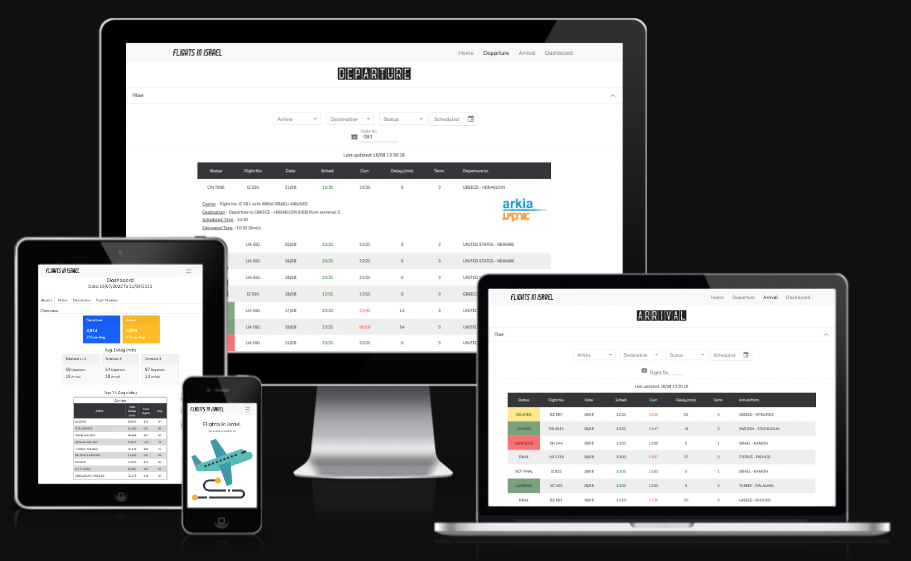

## Flights In Israel
   
Flights in Israel is the app that, as the title says, brings all the passenger flights in and out from Israel Ben Gurion Airport.
If you need to check in addition to your flight you also get the full flight history with indication if the flight is delayed (in minutes) or canceled.

DASHBOARD: 
1. Avg. delay
2. Flights per day/hour
3. Statistics per Airline/Flight No
4. Avg. canceled
  
## Lessons Learned

I learned how to implement experiment advanced features such as PWA notification, also learnd to implement notification with firebase.
Working with complex database on MongoDB, user authentication.

## Demo

https://flights-in-israel.herokuapp.com/

## Screenshots

   <p align="left"><p/>

   

   <p align="left"><p/>
   
   
## Tech Stack

**Client:** React.js, Redux, SCSS

**Server:** Node.js, MongoDB

**Main Dependencies:** cors, mui, react-icons, PWA, notification

   <p align="left">
   <a href="https://sass-lang.com" target="_blank" rel="noreferrer"> 
      </a>
         <a href="https://reactjs.org/" target="_blank" rel="noreferrer"> 
      </a>
       <a href="https://redux.js.org" target="_blank" rel="noreferrer">
         
      </a>
      <a href="https://nodejs.org" target="_blank" rel="noreferrer">
         
      </a>
      <a href="https://www.mongodb.com/" target="_blank" rel="noreferrer"> 
      </a>
           <a href="https://heroku.com" target="_blank" rel="noreferrer"> 
      </a>
   </p>
      
## Deployment

Clone the project - Frontend

```bash
  git clone https://github.com/EranAAA/flights-in-israel-frontend.git
  npm i --force
  npm start
```

Clone the project - Backend

```bash
  git clone https://github.com/EranAAA/flights-in-israel-backend.git
  npm i
  npm start
```
MongoDB: 
Create database: board_db
collection: user, board

